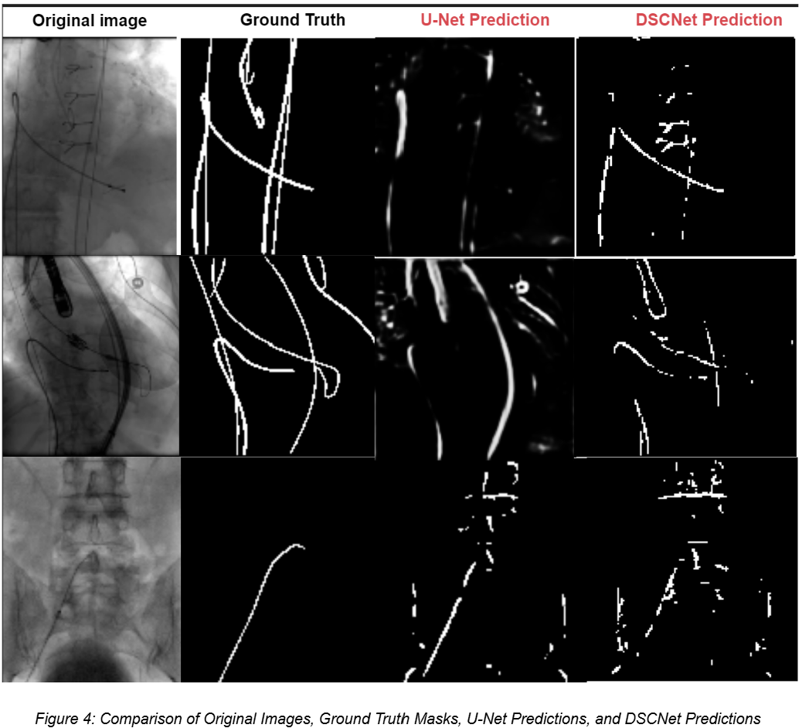

# Interventional Catheter Segmentation
This project focuses on using a novel deep learning model, DSCNet, to improve the accuracy of interventional catheter segmentation in medical imaging. The model is designed to address challenges such as the thin, tortuous nature of catheters, low imaging contrast, and noise, providing enhanced segmentation performance for applications in endovascular surgery and cardiology.

## Project Overview
Catheter segmentation is critical for guiding precise procedures and ensuring patient safety. This project compares the performance of the widely-used U-Net model with the newly developed DSCNet model, which incorporates innovative features such as dynamic snake convolution and multi-view feature extraction. DSCNet significantly outperforms traditional models, offering superior accuracy and robustness in challenging scenarios.

### Key Features
** Dynamic Snake Convolution (DSConv): Adapts convolutional filters to tubular structures for precise segmentation.

** Multi-View Feature Extraction: Captures diverse morphological features, enhancing generalization across anatomical structures.

** Robust Performance: Achieved an IoU of 0.94 and accuracy of 98% in catheter segmentation tasks.

### Technologies used
** Programming Language: Python.

** Deep Learning Framework: TensorFlow

** Models: U-Net, DSCNet

** Tools: Pandas, Matplotlib for data manipulation and visualization.
### WORFLOW
1. Data Preprocessing:

Cleaned and normalized real-world medical datasets.
Applied data augmentation techniques for enhanced model training.

2. Model Implementation:

Implemented DSCNet to capture fine details in complex anatomical regions.

Compared with U-Net to evaluate performance improvements.

3. Evaluation Metrics:

Intersection over Union (IoU)
Accuracy
4. Results:

DSCNet demonstrated superior segmentation precision and robustness, particularly in complex cases.

### Challenges & Solutions
Compatibility Issues: Addressed challenges while integrating the DSCNet model, resolving them within a week to achieve seamless functionality.

Complexity of Datasets: Developed preprocessing pipelines to handle noisy and low-contrast medical images effectively.

## Outputs
Detailed visualizations, including model architecture and segmentation results.

Example output: 

